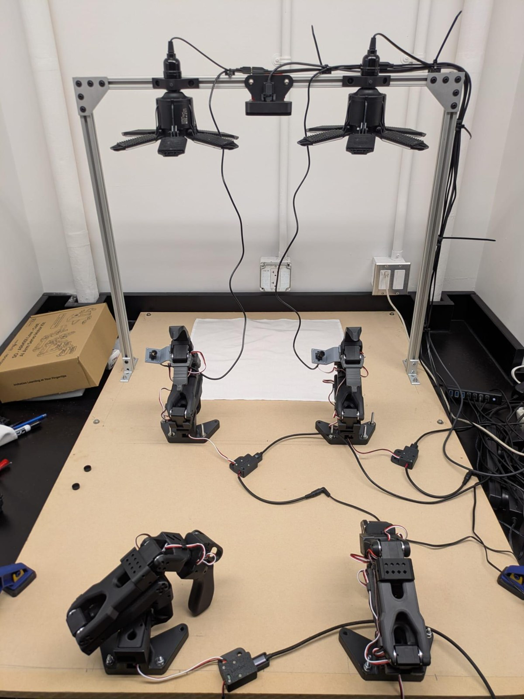
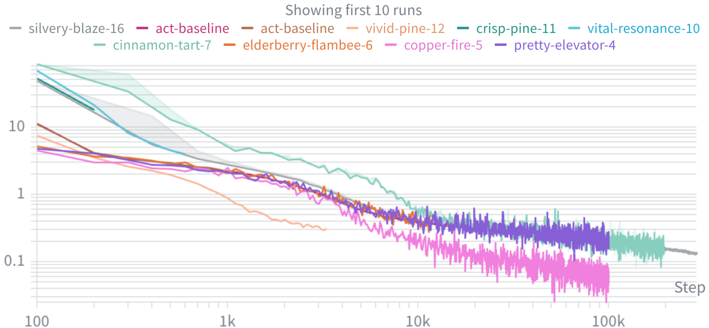
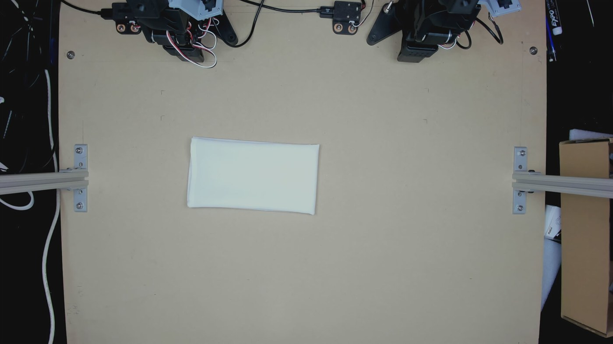
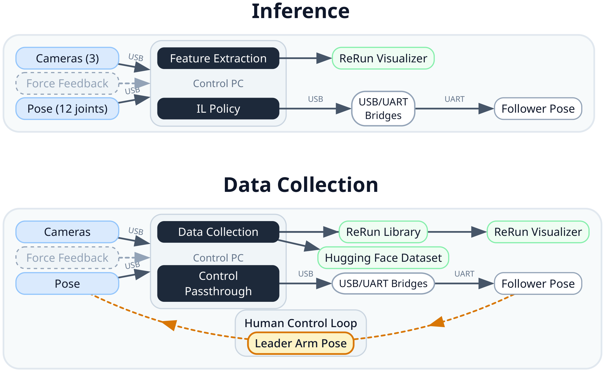
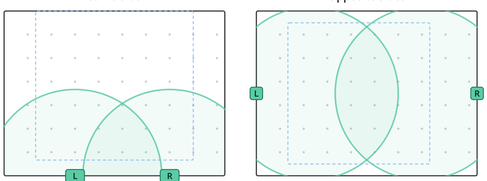
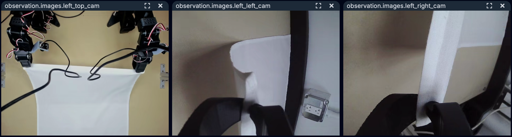

# Bimanual Napkin Folding Robot

**Two 6-DOF robot arms that learn to fold linen napkins from human demonstration. No simulator, no reward engineering, open low-cost hardware.**

[**▶ Watch the demo**](https://x.com/jack_polloway/status/2060747250800988349?s=20) · [**Read the paper**](paper/napkin_folding.pdf) · [**🤗 Datasets and models**](#open-source-contributions)

> **Everything is public.** 499 episodes and ~545k frames of real bimanual cloth manipulation,
> plus the trained policy weights, released on the Hugging Face Hub in standard LeRobot format
> under Apache-2.0.
> [Jump to the open source ↓](#open-source-contributions)



---

## What it does

Two 6-DOF [SO-101](https://github.com/TheRobotStudio/SO-ARM100) arms and a three-camera RGB stack
learn decorative napkin folding entirely from human teleoperation demonstrations, running on the
open-source [LeRobot](https://github.com/huggingface/lerobot) framework.

Cloth is the hard case in manipulation. A rigid object has six degrees of freedom; a napkin has
effectively infinite, and linen's dynamics depend on weave, weight, and finish in ways current
physics engines do not reproduce. The usual recipe of training a policy in simulation with RL and
transferring it to hardware is unavailable here, because the sim-to-real gap for cloth is
prohibitive. So every policy in this system is learned directly from real demonstrations on real
cloth.

The task is narrow on purpose: premium hospitality venues spend one to three hours of paid staff
time per day on decorative folding, which makes it a real workload with a bounded perception and
workspace problem.

## Results

The system was benchmarked against operationally derived deployment requirements, then run for 20
autonomous trials per policy on a freshly ironed 20"×20" linen napkin placed in a randomized
workspace position. A trial counted as a success only if it met *both* the cycle-time and
edge-accuracy thresholds.

| Requirement | Target | SmolVLA achieved |
|---|---|---|
| First-attempt success rate | ≥ 80% (16/20) | **70%** (14/20) |
| Cycle time | ≤ 90 s | **40.2 s** mean |
| Fold accuracy (edge deviation) | ≤ 10 mm | **6 mm** mean |
| Footprint | ≤ 36×36 in | met |

| Policy | Success | Rate | Cycle | Edge dev. |
|---|---|---|---|---|
| **SmolVLA** (450M VLA) [🤗 weights](https://huggingface.co/jhimmens/smolvla-napkin-fold) | 14 / 20 | **70%** | 40.2 s | 6 mm |
| **ACT** (Action-Chunking Transformer), identical data | 0 / 20 | **0%** | n/a | n/a |

SmolVLA cleared the speed and accuracy budgets with margin but missed the 80% deployment
threshold. Five of its six failures were unsuccessful initial grasps and one was a mid-fold slip,
which puts grasp acquisition, not folding, on the critical path.

Two findings from the study are worth more than the headline success rate.

### 1. Gripper geometry beats gripper force

Force-closure grippers, the default choice, squeeze the thing you want to hold. On thin linen that
drags material inward before the fingers close. Four single-DOF end effectors were 3D-printed in
PLA+ and evaluated over teleoperated pickup trials on flat and pre-folded napkins, approached from
both sides:

| Design | Type | Pickup, flat | Pickup, folded | **Crumple, flat** | **Crumple, folded** |
|---|---|---|---|---|---|
| OG (narrow-tip pinch) | force closure | 4.03 s | 3.60 s | 100% | 100% |
| EEJ (thick-jaw pinch) | force closure | 12.68 s | 9.44 s | 77% | 47% |
| EED (wide parallel pads) | force closure | 5.27 s | 4.17 s | 100% | 100% |
| **EES (tangential scoop)** | **geometry entrapment** | 5.74 s | 4.57 s | **0%** | **0%** |

The scoop slides a curved surface beneath the cloth edge and lifts before closing, capturing the
napkin without any compressive loading. It drove crumpling to **zero across every condition
tested**, at a 1 to 2 second pickup penalty that is negligible against a 90 second cycle budget.

That mattered downstream: a crumpled initial grasp produces corner misalignment and crease defects
the folding policy cannot subsequently correct. No control-side fix produced anything comparable.
The mechanical design was the bottleneck.

### 2. The stage-composition bottleneck

ACT failing 0-for-20 while SmolVLA hits 70% on the *same* data looks like a straightforward
model-capacity story. It isn't.

Stage-isolated ablations tell a different story:

| Variant | Training data | Outcome |
|---|---|---|
| ACT, pickup only | 185 episodes | reliable grasps in nearly all trials |
| ACT, fold only | pre-grasped napkin | folds reliably, clean diagonal crease |
| ACT, full task | 314 episodes | **fails to compose the two** |

Each sub-behavior is individually learnable from this data. The combined behavior is not, for a
single monolithic ACT policy. The failure sits at the pickup-to-fold phase boundary, where the
same or a near-identical observation can demand qualitatively different actions: keep grasping, or
begin folding. ACT predicts one action chunk per timestep and cannot represent that multimodality,
so it collapses the two modes and produces motion belonging to neither.

SmolVLA's pretrained vision-language backbone yields richer observation features that *partially*
disambiguate the transition, which is why it works at all. Its 70% ceiling shows that better
representations alone do not fully resolve stage composition.



*Training loss, log-log. Gradient step on the x axis (100 to 200k), behavior-cloning loss on the y.
Each line is one training run logged during ACT development. Note that every single one of them descends
smoothly.*

**The loss-curve trap.** Every run converges. Loss falls monotonically across nearly three orders
of magnitude with no divergence and no instability, and pushing the longest run out to 200k
gradient steps produced no further meaningful reduction. This is exactly what a healthy, well-tuned
training pipeline is supposed to look like, and the full-task ACT policy it produced still succeeds
on 0% of trials. Lower loss did not buy task success either: the run that converged furthest is not
a better folder. Behavior-cloning loss measures prediction error on demonstrated action chunks, not
task success, so a converged loss is fully consistent with catastrophic end-to-end failure when the
failure is one of composition rather than representation. Task-level evaluation, not loss, has to
gate progress. That is the practical lesson from this project: if the team had trusted these curves,
they would have concluded the model was fine.



*Fold produced by the fold-only policy given a stable grasp. When the pickup bottleneck is
bypassed, fold quality already meets the presentation standard. The system's ceiling is set by
grasp acquisition and stage composition, not by the folding motion.*

## System



**Hardware.** Two SO-101 6-DOF arms as followers with custom end effectors, plus a matched pair of
SO-101 leader arms for teleoperation. All four are bolted to a single continuous hardboard base:
stiff enough to hold the arms square during folding, while staying cheap, portable (~12 kg), and
easy to modify. This replaced an earlier optical-breadboard build that was rigid but immobile and
expensive.

**Workspace geometry.** Two arm-spacing layouts were evaluated. The outer-edge layout was selected
over center-mounting because it reduces inter-arm collision risk during fold-over motions and gives
each arm enough independent reach to capture a napkin corner.



**Perception.** Three RGB cameras at 640×480 and 30 fps: one overhead on the gantry for global
napkin pose, two wrist-mounted for local gripper-to-cloth geometry. The redundancy means a critical
feature is unlikely to be occluded in all views at once. Camera viewpoints, lighting, and arm-base
positions are held fixed across sessions to limit distribution shift between demonstration and
deployment.



**Real-time inference at 30 Hz.** LeRobot's default inference path does image preprocessing
(resize, normalize, color-space conversion) on the CPU before handing observations to the GPU. On
the initial workstation that created a CPU bottleneck which starved the GPU and depressed the
control-loop frequency, and at low frequency the gap between observation and action grows until
motion turns jerky and unresponsive. We replaced it with a custom inference path that passes raw
camera frames straight to the GPU, where the policy's own vision encoder does preprocessing inside
the forward pass. That eliminated the bottleneck and restored the target 30 Hz control loop.

## Data and training

**Dataset.** 499 episodes and 544,906 synchronized frames, collected by kinesthetic teleoperation:
an operator drives the SO-101 leader arms, the followers mirror the leader poses, and the system
logs synchronized 12-dimensional joint-angle trajectories together with RGB streams from all three
cameras at 30 fps. All of it is [public](#open-source-contributions).

| Split | Episodes | Frames | Purpose |
|---|---|---|---|
| [Full task](https://huggingface.co/datasets/jhimmens/linique-v2) | 314 | 496,866 | pick up a flat napkin, align corners, execute the complete fold |
| [Pickup only](https://huggingface.co/datasets/jhimmens/linique-v2-pickup) | 185 | 48,040 | added after early ACT runs showed pickup as the dominant failure mode |
| [**Combined**](https://huggingface.co/datasets/jhimmens/linique-v2-fold-pickup) | **499** | **544,906** | both tasks in one corpus |

**Policy families.** ACT (data-efficient, small memory footprint, 100-action chunks) was augmented
with temporal ensembling at inference (coefficient 0.01) and cosine-annealed learning-rate
scheduling, both of which improved trajectory smoothness and training stability over the baseline.
SmolVLA (450M params, ~4 GB VRAM) was the most performant policy in the evaluation. An early X-VLA
experiment was dropped after it commanded trajectories that drove the arms into the table, an
action-space calibration mismatch. Diffusion Policy, a strong candidate for the branching
pickup-to-fold transition precisely because it models the full multimodal action distribution, was
left as future work.

Everything was constrained by an edge inference budget throughout: a deployable policy has to fit
in roughly 8 GB of VRAM, e.g. an NVIDIA Jetson Orin, which rules out the largest VLAs.

**Training infrastructure.** Runs were spread across local consumer GPUs (RTX 2070, then 4070), a
cloud provider (H100 / RTX 5090), and an institutional HPC cluster (A40). Counter-intuitively,
local training had the fastest end-to-end iteration cycle: staging a 545k-frame image dataset and
waiting in HPC job queues negated the raw compute advantage for short experiments. Cloud GPUs were
reserved for long runs, including SmolVLA, where the per-step speedup justified the transfer cost.

**A known limitation.** The pickup-only episodes could not be merged into SmolVLA training:
differences in episode metadata and frame indexing between the two collection runs caused
intermittent dataloader crashes when sampling across the partition boundary. SmolVLA was therefore
trained on the 314 full-task episodes alone. Resolving that schema incompatibility is the single
highest-leverage fix available, since the missing data is exactly the pickup-state coverage the
model needs.

## Future work

- **Combined-corpus training.** Fix the dataset schema mismatch and train SmolVLA on all 499
  episodes rather than 314.
- **Stage-aware decomposition and RL fine-tuning.** Stage-Aware Reward Modeling (SARM) decomposes
  the task into stages (pickup, align, fold, release) and trains a per-stage reward model, with a
  meta-controller sequencing them. That converts the sparse binary task reward into a dense signal,
  which is a prerequisite for RL fine-tuning on top of an imitation-learned initialization and a
  principled remedy for the composition failure above.
- **A continuous fold-quality metric.** Fold quality is currently scored only as binary
  success/failure. A vision-based continuous metric would provide gradient information for both
  evaluation and RL fine-tuning.

## My contributions

This was a seven-person team project. My work concentrated on two areas:

**Policy training and deployment**
- Trained the vision-language-action and ACT policy families on cloud GPUs.
- Deployed trained policies for real-time closed-loop inference on the physical arms.
- **Diagnosed and patched the inference-path bottleneck in upstream LeRobot.** Its default path
  ran image preprocessing (resize, normalize, color-space conversion) on the CPU before handing
  observations to the GPU. That starved the GPU, pulled the control loop below its 30 Hz target,
  and widened the observation-to-action gap until arm motion turned visibly jerky. I rerouted raw
  camera frames straight to the GPU so the policy's own vision encoder does preprocessing inside
  the forward pass, which removed the bottleneck and restored the full 30 Hz loop.
- Owned the pipeline end to end, from raw collected data through to a policy running on hardware.

**Dataset and teleoperation**
- Collected the teleoperation dataset across 3 synchronized camera views, the corpus now released
  publicly as [`linique-v2`](https://huggingface.co/datasets/jhimmens/linique-v2) and
  [`linique-v2-fold-pickup`](https://huggingface.co/datasets/jhimmens/linique-v2-fold-pickup) on
  the Hugging Face Hub.

## Open source contributions

Real bimanual cloth-manipulation data is scarce, and it is the expensive part of this kind of
project: roughly five hours of a human driving leader arms, one napkin at a time. All of it is
public, in standard [LeRobot](https://github.com/huggingface/lerobot) format, so it loads with two
lines and needs no conversion.

**Datasets** ([full profile](https://huggingface.co/jhimmens))

| Dataset | Episodes | Frames | What it is |
|---|---|---|---|
| [**linique-v2-fold-pickup**](https://huggingface.co/datasets/jhimmens/linique-v2-fold-pickup) | **499** | **544,906** | The complete corpus, both tasks. Start here. Citable: [`10.57967/hf/8174`](https://doi.org/10.57967/hf/8174) |
| [linique-v2](https://huggingface.co/datasets/jhimmens/linique-v2) | 314 | 496,866 | Full-task only: pick up a flat napkin, align corners, complete the fold |
| [linique-v2-pickup](https://huggingface.co/datasets/jhimmens/linique-v2-pickup) | 185 | 48,040 | Pickup and corner-capture phase in isolation |
| [linique-v2-pickup-force](https://huggingface.co/datasets/jhimmens/linique-v2-pickup-force) | 189 | 50,077 | Pickup with force sensing: 24-dim state instead of 12 |
| [linique-v2-combined-force](https://huggingface.co/datasets/jhimmens/linique-v2-combined-force) † | 503 | 546,943 | Full corpus with force sensing, 24-dim state |
| [linique-v2-load-padded](https://huggingface.co/datasets/jhimmens/linique-v2-load-padded) † | 314 | 496,866 | Full-task with padded load channels, 24-dim state |

Every episode carries three synchronized 640×480 RGB streams (one overhead, two wrist-mounted) at
30 fps alongside 12-dimensional bimanual joint trajectories, recorded on a `bi_so_follower` robot.

**Trained policies**

| Model | Base | Trained on |
|---|---|---|
| [**smolvla-napkin-fold**](https://huggingface.co/jhimmens/smolvla-napkin-fold) | [lerobot/smolvla_base](https://huggingface.co/lerobot/smolvla_base) | `linique-v2`. This is the 70% policy from the results table above. |
| [xvla-linique-v2-fold-pickup](https://huggingface.co/jhimmens/xvla-linique-v2-fold-pickup) | X-VLA | `linique-v2-fold-pickup` |

```python
from lerobot.datasets.lerobot_dataset import LeRobotDataset

# the full 499-episode corpus, LeRobot dataset format v3.0
dataset = LeRobotDataset("jhimmens/linique-v2-fold-pickup")
```

Or browse it in the [dataset
visualizer](https://huggingface.co/spaces/lerobot/visualize_dataset?path=jhimmens/linique-v2-fold-pickup)
without downloading anything.

The full corpus, the two phase splits, the force-sensing pickup set, and both models are
Apache-2.0, so they are usable commercially and for derivative work without asking. If you train
something better on this data, that is the point of releasing it.

† These two variants are public but do not yet carry a declared license, so treat them as
all-rights-reserved until one is added.

## Paper

**Bimanual Imitation Learning for Decorative Napkin Folding on Low-Cost Hardware: End-Effector
Geometry and the Stage-Composition Bottleneck**

Joshua Himmens, Sloan Sobie, Dawson March, Genevieve Merz, Cameron Powell, Jaden Legate, Jack Polloway
*University of British Columbia, Vancouver, BC, Canada*

[📄 Full paper (PDF)](paper/napkin_folding.pdf)
## Notes on this repo

This is a project write-up, not the implementation. The system is built on a fork of
[huggingface/lerobot](https://github.com/huggingface/lerobot); this repo holds the paper, the figures, and a summary of the work.
